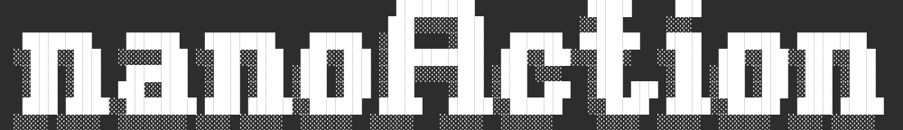

# nanoAction



> The best VLA that $500 can buy for a $500 robot

This repo will directly extend off of the [nanochat](https://github.com/karpathy/nanochat) repo, and will be a full-stack implementation of a VLA trained on a corpus of robotics data.  This script will generate a light-weight VLA that can be used to control, single camera, low DOF robots.

We will make the enhancements to the nanochat repo:

1. Add a vision encoder to the model
   - v1 will use an existing encoder
   - v2 will train a custom encoder
2. Add an action head to the model in the spirit of [Pi0.5](https://github.com/Physical-Intelligence/openpi)
   - Train on a corpus of robotics data
3. Finetune the model for a specific model in IsaacSim
   - v1 Koch Robot arm with wrist camera
4. Record a corpus of robotics data from a real robot
   - v1 finetune on the corpus on live robot

A major goal of this is to create a basic foundational robotics policy to run on 3d printed open source hardware.

- $250 [Jetson Orin Nano Super](https://www.nvidia.com/en-us/autonomous-machines/embedded-systems/jetson-orin/nano-super-developer-kit/)
- ~$250 3d printed arm - Like the [Koch arm](https://www.robotis.us/koch-v1-1-low-cost-robot-arm-follower/) or [SO-ARM100](https://github.com/TheRobotStudio/SO-ARM100)

We will reference best practices of the LeRobot team and community to make this VLA compatible with the LeRobot ecosystem.

Additional references:

- <https://huggingface.co/lerobot/pi05_base>
- <https://github.com/Physical-Intelligence/openpi>
- <https://lei-kun.github.io/RL-100/> [pdf](https://lei-kun.github.io/RL-100/RL100_files/our_tasks/RL_100.pdf)

Background Knowledge:

- LeRobot Tutorial <https://huggingface.co/papers/2510.12403> [code](https://github.com/fracapuano/robot-learning-tutorial) [pdf](https://arxiv.org/pdf/2510.12403)
- [NanoVLA: Routing Decoupled Vision-Language Understanding for Nano-sized Generalist Robotic Policies](https://openreview.net/forum?id=yeHBrNVZoV) [pdf](https://openreview.net/pdf?id=yeHBrNVZoV) and [code](https://anonymous.4open.science/r/nanovla-38EC/README.md)

## Step 0: Starting from scratch

Referencing [README-NANOCHAT.md](README-NANOCHAT.md) and [speedrun.sh](speedrun.sh), we will could from scratch.  However we will leverage some of the existing images from the community to make the process faster.

We should be able to pull down a pre-trained model from the nanochat repo and use it as a starting point for our VLA

- [karpathy/nanochat-d32](https://huggingface.co/karpathy/nanochat-d32) and [description](https://github.com/karpathy/nanochat/discussions/8)

### Task list

- [x] Chat locally with the pre-trained model and confirm behavior is as expected
  - `PYTORCH_CUDA_ALLOC_CONF=expandable_segments:True && python -m scripts.chat_cli -p "Why is the sky blue?"`
- [ ] Compare architecture of nanochat to existing VLMs like (<https://huggingface.co/blog/nanovlm>) and VLAs like Pi0.5 and OpenVLA
- [ ] Review initial VLM extensions of nanochat like [make nanochat multimodal for < $10!](https://x.com/_rajanagarwal/status/1978376536152785368)

## Step 1: Working nanochat (with VL)

The chat interface should accept one or more images and a text prompt.  The model should generate a response.

## Step 2: Train on robotics data

TODO

## Step 3: Finetune on robotics data

TODO

## Step 4: Record robotics data

TODO

## Citation

If you find nanoaction helpful in your research cite simply as:

```bibtex
@misc{nanoaction,
  author = {Sean Kruzel},
  title = {nanoaction: The best VLA that $500 can buy for a $500 robot},
  year = {2025},
  publisher = {GitHub},
  url = {https://github.com/closedloop-tech/nanoaction}
}
```

A huge thanks to Andrej Karpathy for the nanochat repo and the nanochat-d32 model.

```bibtex
@misc{nanochat,
  author = {Andrej Karpathy},
  title = {nanochat: The best ChatGPT that $100 can buy},
  year = {2025},
  publisher = {GitHub},
  url = {https://github.com/karpathy/nanochat}
}
```

## License

MIT
